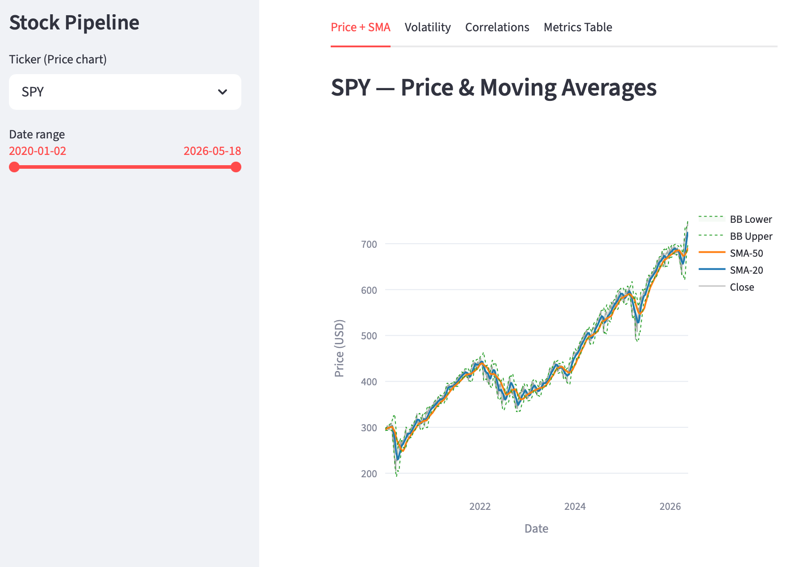
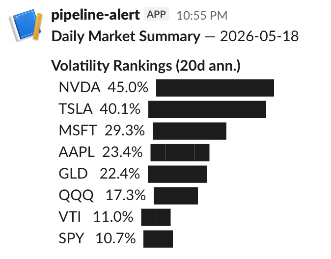

# Stock Data Pipeline

An end-to-end pipeline that fetches daily OHLCV data for stocks and ETFs, computes technical indicators, tracks correlations, sends Slack alerts, and serves a live interactive dashboard — automated on a daily cron schedule.

**Stack:** Python · yfinance · PostgreSQL (Neon) · SQLAlchemy · pandas · matplotlib · Plotly · Streamlit

**Live dashboard:** [stock-data-pipeline on Streamlit Cloud](https://stock-data-pipeline.streamlit.app)

---

## Architecture

```
yfinance API
     │
     ▼
loader.py  ──────────────►  prices table (Neon)
                                  │
                          ┌───────┴────────┐
                          ▼                ▼
                    analysis.py      correlations.py
                          │                │
                          ▼                ▼
                    metrics table    correlations table
                          │
                    ┌─────┴──────┐
                    ▼            ▼
                alert.py     plot.py
                    │            │
                    ▼            ▼
             Slack message   charts/*.png

dashboard.py  ←──── reads all tables ────────────────► Streamlit Cloud
```

---

## Setup

**Prerequisites:** Python 3.13+, Homebrew (macOS)

```bash
# 1. Clone and create virtualenv
git clone https://github.com/suheum-heo/stock-data-pipeline.git
cd stock-data-pipeline
python3 -m venv .venv
source .venv/bin/activate

# 2. Install dependencies
pip install -r requirements.txt

# 3. Configure environment
cp .streamlit/secrets.toml.example .env
# Edit .env and fill in DATABASE_URL and SLACK_WEBHOOK_URL

# 4. Create tables
python schema.py

# 5. Load historical data (2020–present)
python loader.py
python analysis.py
python correlations.py
```

---

## Usage

### Load price data
```bash
python loader.py                        # all tickers, full history
python loader.py --tickers SPY QQQ      # specific tickers
python loader.py --start 2024-01-01     # custom start date
```

### Compute indicators + correlations
```bash
python analysis.py      # SMA, Bollinger Bands, RSI, MACD, volatility
python correlations.py  # rolling 30-day return correlations
```

### Alerts
```bash
python alert.py   # sends daily Slack summary + spike warning if vol > 50%
```

### Charts
```bash
python plot.py              # saves PNGs to charts/ and opens interactive display
python plot.py --no-show    # headless — saves PNGs only
```

### Dashboard
```bash
streamlit run dashboard.py
```

### Run full pipeline manually
```bash
bash pipeline.sh
```

---

## Tickers

| Ticker | Description |
|--------|-------------|
| SPY | S&P 500 ETF |
| QQQ | Nasdaq-100 ETF |
| VTI | Total US Market ETF |
| GLD | Gold ETF |
| AAPL | Apple |
| MSFT | Microsoft |
| NVDA | Nvidia |
| TSLA | Tesla |

Add or remove tickers in `config.py`.

---

## Database Schema

### `prices`
Raw OHLCV data loaded from yfinance.

| Column | Type | Description |
|--------|------|-------------|
| ticker | VARCHAR(10) | Ticker symbol |
| date | DATE | Trading date |
| open / high / low / close | NUMERIC(12,4) | Price data |
| volume | BIGINT | Daily volume |

### `metrics`
Derived indicators computed via SQL window functions + pandas.

| Column | Type | Description |
|--------|------|-------------|
| sma_20 / sma_50 | NUMERIC(12,4) | 20/50-day simple moving average |
| bb_upper / bb_lower | NUMERIC(12,4) | Bollinger Bands (SMA-20 ± 2σ) |
| daily_return | NUMERIC(10,6) | Close-to-close daily return |
| volatility_20 | NUMERIC(10,6) | Annualized 20-day rolling volatility |
| rsi_14 | NUMERIC(6,2) | 14-day RSI (Wilder's smoothing) |
| macd / macd_signal | NUMERIC(10,6) | MACD line and 9-day signal |

### `correlations`
Rolling 30-day Pearson correlations between all ticker pairs.

| Column | Type | Description |
|--------|------|-------------|
| date | DATE | Window end date |
| ticker_a / ticker_b | VARCHAR(10) | Ticker pair |
| correlation | NUMERIC(6,4) | Pearson correlation of daily returns |

All tables use upsert — reloading data is always safe.

---

## Dashboard



Four tabs served on Streamlit Cloud:

- **Price + SMA** — Interactive Plotly chart: close price, SMA-20/50, Bollinger Bands
- **Volatility** — Bar chart of current annualized vol per ticker, flagged red above 50%
- **Correlations** — Heatmap of latest 30-day return correlations across all tickers
- **Metrics Table** — Sortable table of latest SMA, RSI, MACD, vol for all tickers

---

## Alerts



`alert.py` sends a daily Slack message every weekday with:
- Volatility rankings for all 8 tickers
- A spike warning section if any ticker exceeds 50% annualized volatility

Set `SLACK_WEBHOOK_URL` in `.env` to activate.

---

## Automation

The pipeline runs automatically every weekday at 6pm via cron:

```
0 18 * * 1-5 /path/to/stock-data-pipeline/pipeline.sh
```

`pipeline.sh` runs: `loader → analysis → correlations → alert → plot`

Output is appended to `pipeline.log`. To register:
```bash
cd /path/to/stock-data-pipeline && pwd   # copy this path

crontab -e
# add: 0 18 * * 1-5 <paste path>/pipeline.sh
```

---

## Streamlit Cloud Deployment

1. Push repo to GitHub
2. Go to [share.streamlit.io](https://share.streamlit.io) → New app → select `dashboard.py`
3. Under **Advanced settings → Secrets**, add:
```toml
DATABASE_URL = "your-neon-connection-string"
```
4. Deploy

The cron job writes to Neon daily — the cloud dashboard always has fresh data.

---

## Project Structure

```
stock-data-pipeline/
├── config.py          # DB URL (env-aware), ticker list, default start date
├── schema.py          # Table definitions — idempotent, safe to re-run
├── loader.py          # Fetch from yfinance → upsert prices
├── analysis.py        # SMA, BB, RSI, MACD, volatility → upsert metrics
├── correlations.py    # Rolling 30d correlations → upsert correlations
├── alert.py           # Daily Slack summary + volatility spike alert
├── plot.py            # Static matplotlib charts → charts/*.png
├── dashboard.py       # Streamlit dashboard (4 tabs)
├── pipeline.sh        # Full pipeline runner (used by cron)
├── requirements.txt   # Python dependencies for Streamlit Cloud
├── docs/              # Sample charts for README
├── charts/            # Generated PNGs (gitignored)
├── pipeline.log       # Cron run logs (gitignored)
├── .env               # Local secrets — DATABASE_URL, SLACK_WEBHOOK_URL (gitignored)
├── .streamlit/
│   └── secrets.toml.example
└── tasks/
    ├── todo.md
    └── lessons.md
```
