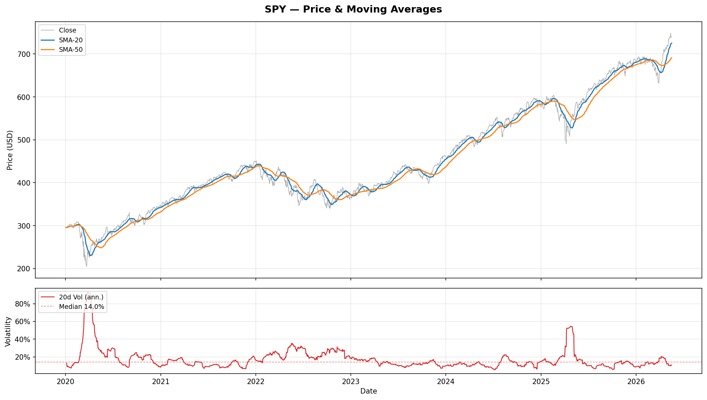

# Stock Data Pipeline

An end-to-end pipeline that fetches daily OHLCV data for stocks and ETFs, computes technical indicators via SQL window functions, and generates charts — automated on a daily cron schedule.

**Stack:** Python · yfinance · PostgreSQL 16 · SQLAlchemy · pandas · matplotlib

---

## Architecture

```
yfinance API
     │
     ▼
loader.py  ──────────────►  prices table
                                  │
                                  ▼
                           analysis.py  ───►  metrics table
                                                    │
                                                    ▼
                                              plot.py  ───►  charts/*.png
```

---

## Setup

**Prerequisites:** Python 3.13+, PostgreSQL 16, Homebrew (macOS)

```bash
# 1. Clone and create virtualenv
git clone https://github.com/suheum-heo/stock-data-pipeline.git
cd stock-data-pipeline
python3 -m venv .venv
source .venv/bin/activate

# 2. Install dependencies
pip install yfinance pandas sqlalchemy psycopg2-binary matplotlib

# 3. Create the database
createdb stock_pipeline

# 4. Create tables
python schema.py
```

---

## Usage

### Load price data
```bash
python loader.py                        # all tickers, full history (2020–present)
python loader.py --tickers SPY QQQ      # specific tickers
python loader.py --start 2024-01-01     # custom start date
```

### Compute indicators
```bash
python analysis.py
```

### Generate charts
```bash
python plot.py              # saves PNGs to charts/ and opens interactive display
python plot.py --no-show    # headless — saves PNGs only
```

### Run full pipeline manually
```bash
bash pipeline.sh
```

---

## Tickers

| Ticker | Description |
|--------|-------------|
| SPY | S&P 500 ETF |
| QQQ | Nasdaq-100 ETF |
| VTI | Total US Market ETF |
| GLD | Gold ETF |
| AAPL | Apple |
| MSFT | Microsoft |
| NVDA | Nvidia |
| TSLA | Tesla |

Add or remove tickers in `config.py`.

---

## Database Schema

### `prices`
Raw OHLCV data loaded from yfinance.

| Column | Type | Description |
|--------|------|-------------|
| ticker | VARCHAR(10) | Ticker symbol |
| date | DATE | Trading date |
| open / high / low / close | NUMERIC(12,4) | Price data |
| volume | BIGINT | Daily volume |

### `metrics`
Derived indicators computed via SQL window functions.

| Column | Type | Description |
|--------|------|-------------|
| ticker | VARCHAR(10) | Ticker symbol |
| date | DATE | Trading date |
| sma_20 | NUMERIC(12,4) | 20-day simple moving average |
| sma_50 | NUMERIC(12,4) | 50-day simple moving average |
| daily_return | NUMERIC(10,6) | Daily return (close-to-close) |
| volatility_20 | NUMERIC(10,6) | Annualized 20-day rolling volatility |

Both tables use `UNIQUE (ticker, date)` — reloading data is always safe (upsert).

---

## Charts



Each ticker produces a two-panel chart saved to `charts/<TICKER>.png`:

- **Top:** Close price with SMA-20 and SMA-50 overlaid
- **Bottom:** Annualized 20-day rolling volatility with median reference line

---

## Automation

The pipeline runs automatically every weekday at 6pm via cron:

```
0 18 * * 1-5 /path/to/stock-data-pipeline/pipeline.sh
```

Output is appended to `pipeline.log`. To register manually:
```bash
# Get your absolute path first
cd /path/to/stock-data-pipeline && pwd

crontab -e
# add: 0 18 * * 1-5 <paste pwd output>/pipeline.sh
```

---

## Project Structure

```
stock-data-pipeline/
├── config.py        # DB URL, ticker list, default start date
├── schema.py        # Table definitions (idempotent)
├── loader.py        # Fetch from yfinance → upsert prices
├── analysis.py      # Window function SQL → upsert metrics
├── plot.py          # Generate charts from metrics
├── pipeline.sh      # End-to-end runner (used by cron)
├── charts/          # Generated PNGs (gitignored)
├── pipeline.log     # Cron run logs (gitignored)
└── tasks/
    ├── todo.md
    └── lessons.md
```
